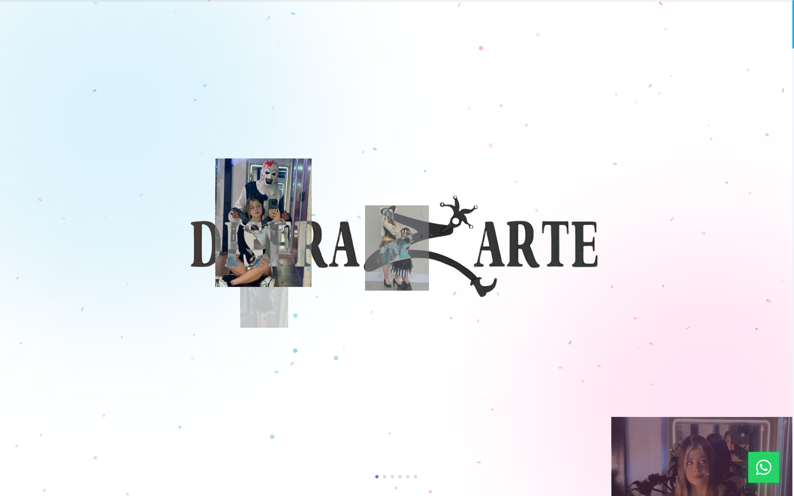
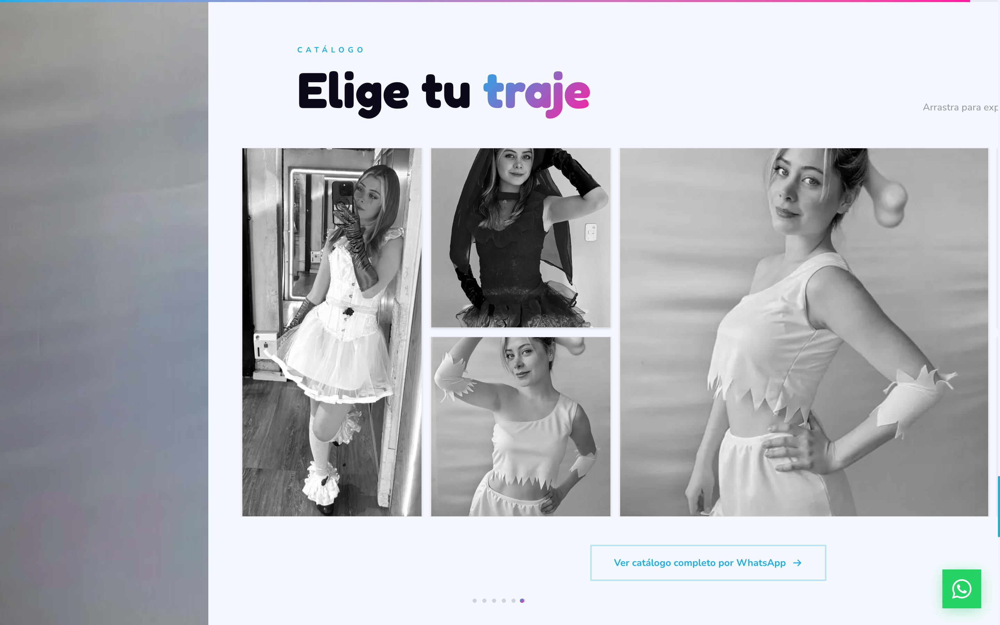
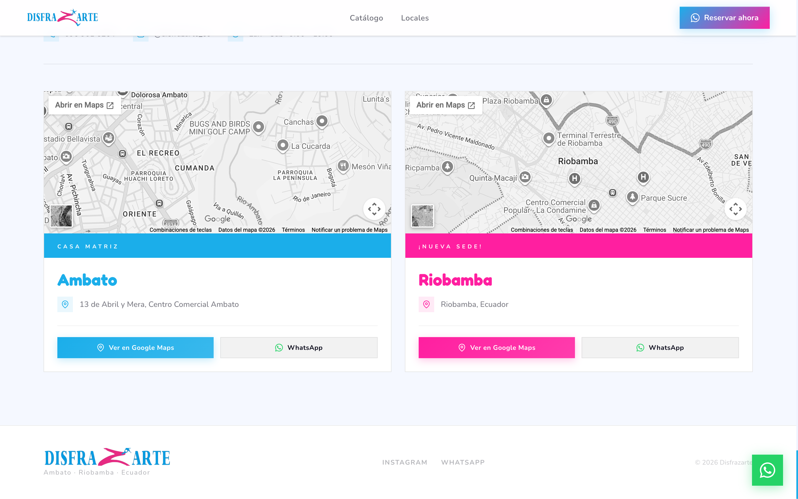

# Disfrazarte

> Tienda online de alquiler de trajes y disfraces — Ambato & Riobamba, Ecuador.

**Live demo:** https://disfrazarte-delta.vercel.app

---

## Screenshots

### Hero


### Catálogo


### Locales


---

## Stack

| Capa | Tecnología |
|------|-----------|
| Framework | Next.js 16 (App Router) |
| Lenguaje | TypeScript 5 |
| Estilos | Tailwind CSS v4 |
| Fuentes | Fredoka + Nunito (Google Fonts) |
| Animaciones | Motion (Framer Motion) |
| Mapas | Google Maps embed |
| SEO | Metadata API, OG image, JSON-LD, robots.txt, sitemap.xml |
| Analytics | Google Analytics 4 (opcional via `NEXT_PUBLIC_GA_ID`) |
| Chat IA | Google Gemini Flash Lite (`gemini-flash-lite-latest`) |
| Tema | next-themes (dark / light / system) |
| Deploy | Vercel |

---

## Levantar localmente

### Requisitos

- Node.js 20+
- npm 10+

### Pasos

```bash
# 1. Clonar el repositorio
git clone https://github.com/DavidVique1998/disfrazarte.git
cd disfrazarte

# 2. Instalar dependencias
npm install

# 3. Variables de entorno
cp .env.example .env.local
# Editar .env.local con tus claves (ver tabla abajo)

# 4. Iniciar servidor de desarrollo
npm run dev
```

Abre http://localhost:3000 en el navegador.

### Variables de entorno

| Variable | Requerida | Descripción |
|----------|-----------|-------------|
| `GEMINI_API_KEY` | **Sí** | API key de Google Gemini para el chat IA |
| `NEXT_PUBLIC_GA_ID` | No | ID de Google Analytics 4 (ej. `G-XXXXXXXXXX`) |

### Scripts disponibles

```bash
npm run dev       # Servidor de desarrollo (http://localhost:3000)
npm run build     # Build de producción
npm run start     # Servidor de producción (requiere build previo)
npm run lint      # Linter ESLint
```

---

## Chat IA

Widget de asistente virtual en la esquina inferior derecha, impulsado por **Google Gemini Flash Lite**:

- Responde preguntas sobre catálogo, reservas, horarios y ubicaciones
- Chips de sugerencias para arrancar la conversación
- Soporte completo de dark mode
- Prompt del sistema entrenado en la información de Disfrazarte
- Ruta Edge: `POST /api/chat` — sin latencia de cold start

---

## Dark Mode

Implementado con `next-themes` (clase CSS `dark`):

- Toggle flotante en la esquina inferior derecha
- Detecta preferencia del sistema por defecto
- Paleta oscura: fondo `#0d0d20`, cards `#12122a`, texto `#f0f4ff`

---

## SEO incluido

- **Metadata completa** — title, description, keywords, OG, Twitter Card
- **JSON-LD** — schema `LocalBusiness` con dos ubicaciones
- **Open Graph image** — generada dinámicamente con foto real de trajes
- **robots.txt** — permite indexación completa
- **sitemap.xml** — generado automáticamente
- **llms.txt** — descripción del sitio para crawlers de IA
- **Favicon SVG** — sombrero de bufón en colores de marca

---

## Contacto

- WhatsApp: +593 96 901 6264
- Instagram: [@disfrazarte_ec](https://www.instagram.com/disfrazarte_ec/)
- Ambato: 13 de Abril y Mera, Centro Comercial Ambato
- Riobamba: Riobamba, Ecuador
